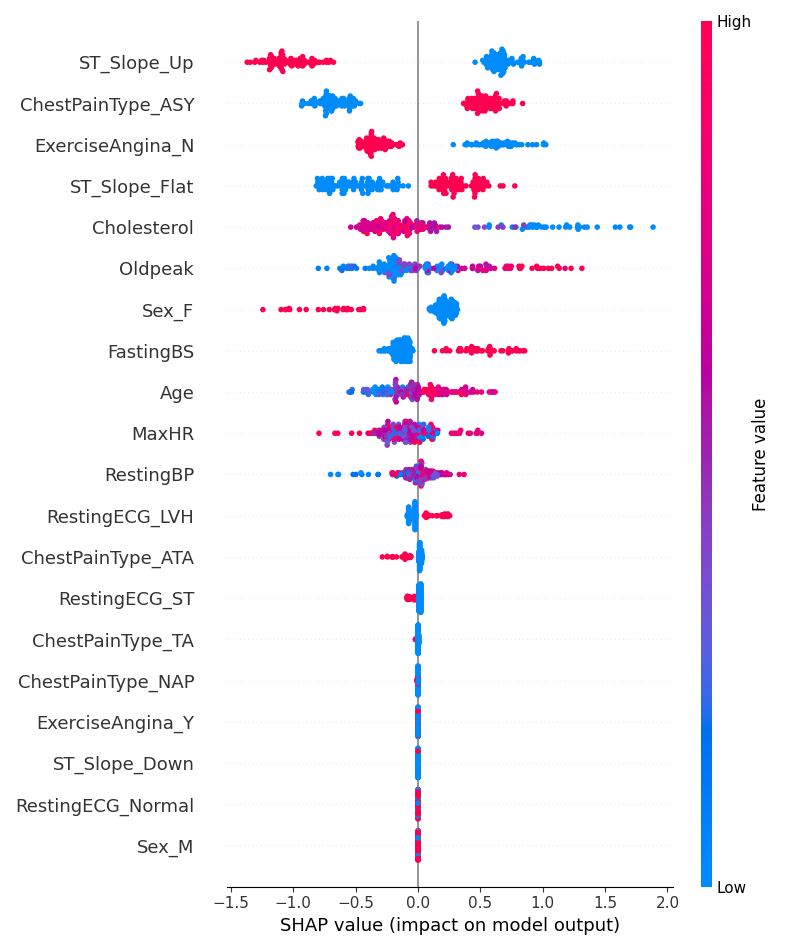

#  Heart Disease Predictor

My first machine learning project that predicts the likelihood of heart disease based on patient data. Built using a trained XGBoost pipeline and visualized with SHAP for interpretability as well as an interactive streamlit web app.

For more detailed explanations, please continue reading this README and also the comments in the code.

> This project is buit after completing Andrew Ng's Machine Learning Specialization.

## Live Demo
[Click here to use the app](https://heart-disease-predictor-zl.streamlit.app/)


## Dataset Source: [Kaggle - Heart Failure Prediction](https://www.kaggle.com/datasets/fedesoriano/heart-failure-prediction)


## How to Run Locally
```bash
git clone https://github.com/Zifan12/heart-disease-predictor.git
cd heart-disease-predictor
pip install -r requirements.txt
streamlit run app/streamlit_app.py

Alternatively, if you want to train the model in the terminal: python src/train_model.py
```

## Project Structure
- `app/streamlit_app.py` – Main Streamlit web app
- `data/` – Raw dataset from Kaggle (`heart.csv`)
- `models/` – Trained ML model (`best_xgb_pipeline.pkl`)
- `notebooks/eda.ipynb` – Exploratory Data Analysis
- `plots/` – Saved visualizations (e.g., SHAP plots, ROC curves)
- `src/train_model.py` – Model training 
- `src/pipelines.py` – Preprocessing & pipeline 
- `src/evaluate.py` – Evaluation functions
- `src/utils.py` – Helper utilities
- `requirements.txt` – Python dependencies
- `README.md` – Project overview, descriptions, instructions, etc

## Input Features Used

- `Age`: Patient age (20–100)
- `Sex`: Male or Female
- `ChestPainType`: Type of chest pain (ATA, ASY, NAP, TA)
- `RestingBP`: Resting blood pressure (mm Hg)
- `Cholesterol`: Serum cholesterol (mg/dl)
- `FastingBS`: Fasting blood sugar > 120 mg/dl (1 = Yes, 0 = No)
- `RestingECG`: Resting electrocardiographic results
- `MaxHR`: Maximum heart rate achieved
- `ExerciseAngina`: Exercise-induced angina (Y/N)
- `Oldpeak`: ST depression induced by exercise
- `ST_Slope`: Slope of the peak exercise ST segment

## Model Used 
Three different models were trained and evaulated for heart disease classification:
- **Logistic Regression**
- **Random Forest**
- **XGBoost Classifier**


| Model               | Accuracy | Precision | Recall | F1 Score |
|---------------------|----------|-----------|--------|----------|
| Logistic Regression |  0.8587  |  0.8634   | 0.8587 | 0.8594   |
| Random Forest       | 0.8750   | 0.8753    | 0.8750  | 0.8751  |
| **XGBoost**         | **0.8804** | **0.8820**  | **0.8804** | **0.8808** |

> After comparing the performance using metrics like Accuracy, F1 Score, etc,  **XGBoost** was determined as the final model for further analysis due to its slightly better performance.


## Overfitting & Model Tuning

Initial trained model showed signs of overfitting, especially **XGBoost** and **Random Forest** where the training performance was perfect (F1 = 1.00), but test performance was lower. Logistic Regression showed no signs of overfitting.

To address this, I used `GridSearchCV` with chosen hyperparameter grids to regularize the models and improve generalization.

### Before Tuning In Overfitting

| Model         | Dataset | Accuracy | F1 Score | Precision | Recall |
|---------------|---------|----------|----------|-----------|--------|
| **Random Forest (Before)** | Train   | 1.0000   | 1.0000   | 1.0000    | 1.0000 |
|                         | Test    | 0.8587   | 0.8591   | 0.8604    | 0.8587 |
| **XGBoost (Before)**     | Train   | 1.0000   | 1.0000   | 1.0000    | 1.0000 |
|                         | Test    | 0.8804   | 0.8811   | 0.8850    | 0.8804 |

### After Tuning In Overfitting

| Model         | Dataset | Accuracy | F1 Score | Precision | Recall |
|---------------|---------|----------|----------|-----------|--------|
| **Random Forest (After)** | Train   | 0.9155   | 0.9153    | 0.9164    |  0.9155 |
|                         | Test    | 0.8587   | 0.8591   | 0.8604    | 0.8587 |
| **XGBoost (After)**     | Train   | 0.9169    | 0.9167   |  0.9171     |  0.9169 |
|                         | Test    | 0.8804   | 0.8808   | 0.8820    | 0.8804 |

###  Final Tuned Parameter Grids
<details>
<summary>Random Forest Parameters (Before vs After)</summary>

**Before:**
```python
{
    'classifier__n_estimators': [100, 200],
    'classifier__max_depth': [None, 10, 20]
}

```
**After**
```python
{
    'classifier__n_estimators': [100, 200],
    'classifier__max_depth': [5, 8, 12],
    'classifier__min_samples_split': [5, 10],
    'classifier__min_samples_leaf': [3, 5, 8]
}
```
</details>

<details>
<summary> XGBoost Parameters (Before vs After)</summary>
**Before:**
```python
{
    'classifier__n_estimators': [100, 200],
    'classifier__max_depth': [None, 10, 20],
    'classifier__learning_rate': [0.01, 0.1, 0.2]
}
```
**After:**
```python
{
    'classifier__n_estimators': [100, 200],
    'classifier__max_depth': [5, 8, 12],
    'classifier__learning_rate': [0.01, 0.1, 0.2],
    'classifier__reg_alpha': [0, 0.1, 0.5, 1],
    'classifier__reg_lambda': [1, 5, 10]
}
```
</details> 

## Threshold optimization
- Instead of using the default threshold of `0.5`, I evalutaed multiple threshold values between `0.10` and `0.89` to find the best threshold that maximizes the F1 Score.

### Approach:
- Generate threshold values from `0.10` to `0.89`
- For each threshold, find the  `F1 Score`, `Precision`, and `Recall`
- Chosed the threshold that had the highest `F1 Score`

### Results

| Threshold | Accuracy | F1 Score | Precision | Recall |
|-----------|----------|----------|-----------|--------|
| **0.50 (default)** | 0.8804   | 0.8808   | 0.8820    | 0.8804 |
| **0.39 (optimized)** | **0.9022**   | **0.9020**   | **0.9020**    | **0.9022** |

## Brief Plots Overview 
- **Confusion Matrices (XGBoost)**: Show how each model performed in terms of true/false positives and negatives.
    
- **Feature Importance (XGBoost)**: Ranked importance of input features based on how much they contribute to the model's prediction. 
    - As shown below, the most influential features are `ST_Slope_Up`, followed by `ExerciseAngina_N` and `ChestPainType_ASY`.
    
- **ROC Curve (XGBoost)**: Plots the true positive rate vs. false positive rate - AUC shows the model's ability to distinguish classes.
    
- **SHAP Bar Plot**: This plot shows the average absolute SHAP value for each feature, representing which features impact the model the most.
    - We can see that `ST_Slope_U`, `ChestPainType_ASY`, and `ExerciseAngina_N` are the contribute the most.
    

- **SHAP Summary Plot**: Provides a more detailed view of how a feature affect individual predictions.
    - Color represents the feature value (red = hight, blue = low).
    - Position (left or right) indicates whether the feature increases or decreases the likelihood of heart disease.
    


## Problems/Potential Improvements 
- **Gender imbalance**: During Exploratory Data Analysis (EDA), it was observed that the dataset contains significantly more male patients than female. This class imbalance could introduce bias into the model, leading to lower accuracy or generalization for females. 
    - Collecting more data for females or more data in general could help balance the dataset and improve fairness.
    - Tried upsampling by duplicating female samples, but it did not significantly improve results.
    - Did not use SMOTE becuase this is a medical context where life's are at stake. Synthesising new data may yield inaccurate predictions.
- **Tune Model Further**: Although I tuned the hyperparameters using GridSearchCV, further performance improvements could be achieved by using more advanced optimization methods.
